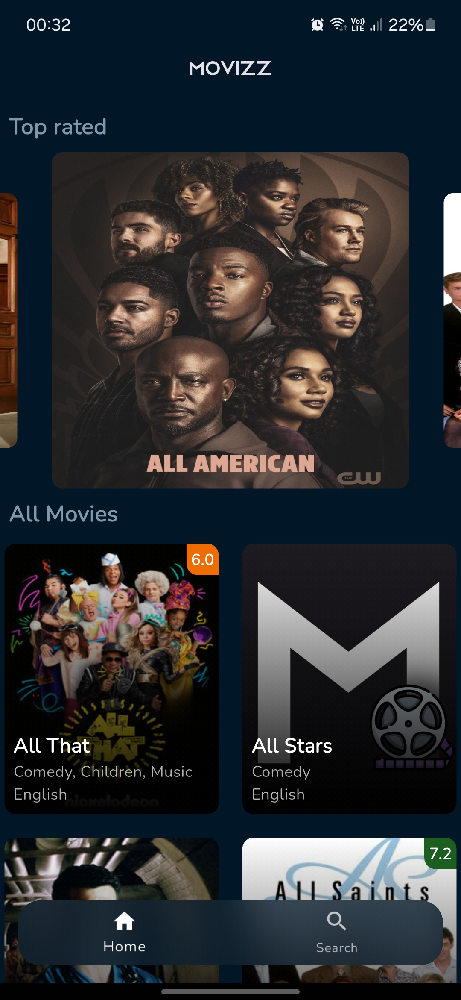
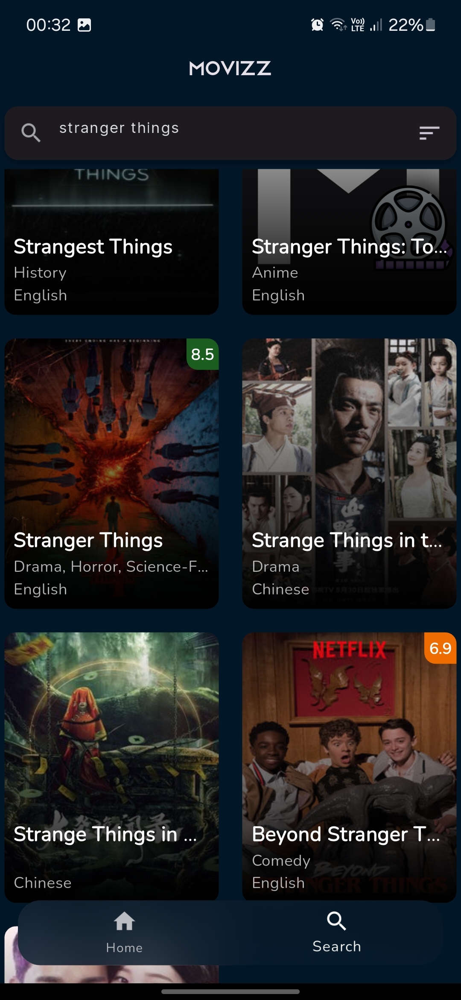

# 

# Movizz

Movizz is a Flutter-based movie and series search application that allows users to explore their favorite series and view their ratings. The application focuses heavily on UI/UX, aligning with the aesthetic of Netflix for a modern and engaging user experience.

---

# Splash screen


# Ui

<p style="text-align: center;">
  
  
  
</p>


## Features

- **Search Functionality**: Users can search for TV series and get detailed information, including ratings.
- **API Integration**: Fetches data from the [TVMaze API](https://api.tvmaze.com/search/shows?q=all).
- **Netflix-Inspired UI**: Designed to mimic Netflix's modern, sleek user interface.

---

## Project Architecture

The application follows a modular structure for better scalability and maintainability:

### **`core`**
- **`utils`**: Contains utility files for common functionalities.
    - `colors.dart`: Defines the color palette used across the app.
    - `dimensions.dart`: Handles responsive design and layout dimensions.
    - `utils.dart`: General utility functions.

### **`models`**
- **`movies_model.dart`**: Represents the structure of the movie/series data fetched from the API.

### **`services`**
- **`services.dart`**: Contains functions for interacting with the TVMaze API.

### **`view`**
- **`widget`**: Contains reusable widgets.
    - `loading_widget.dart`: Displays a loading indicator.
    - `movie_card.dart`: Custom widget to display series details like name, image, and ratings.
- **Pages**:
    - `details_page.dart`: Displays detailed information about a selected series.
    - `home_page.dart`: Serves as the app's main landing page with search functionality.
    - `main_screen.dart`: Wrapper for the app's main navigation.
    - `search_page.dart`: Dedicated page for search results.

---

## Setup Instructions

1. Clone this repository.
   ```bash
   git clone https://github.com/your-repo/movizz.git
   ```

2. Navigate to the project directory.
   ```bash
   cd movizz
   ```

3. Install dependencies.
   ```bash
   flutter pub get
   ```

4. Run the app on your emulator or connected device.
   ```bash
   flutter run
   ```

---

## Screenshots

### 1. Home Page
Displays a Netflix-like home interface with a prominent search bar.

### 2. Search Results
Shows a grid of series results, including thumbnails and ratings.

### 3. Details Page
Provides detailed information about a series, including description and ratings.

---

## API Used
This app fetches series data from the TVMaze API:

**Endpoint**: [https://api.tvmaze.com/search/shows?q=all](https://api.tvmaze.com/search/shows?q=all)

**Example Response**:
```json
[
  {
    "score": 17.5,
    "show": {
      "name": "The Office",
      "rating": {"average": 9.0},
      "image": {"medium": "https://example.com/image.jpg"}
    }
  }
]
```

---

## Contributions
Contributions are welcome! Feel free to open issues or submit pull requests for improvements.

---

## License
This project is licensed under the MIT License. See the LICENSE file for details.

---

*By Shubham Choudhary*


